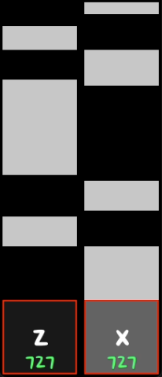

# Key Trail Overlay
A PyGame overlay that shows key presses, trails, and counters, grabbing keyboard input using Pynput.

To use this, run `main.py` with Python.

## Configuration
To change what is shown on the overlay, edit `config.json` before running it.
Make sure to follow valid JSON syntax.

The keys you want to show should be added to the `keys` array as an object
containing at least `key: string` and `position: [int, int]`. All possible options
can be found in `defaultKeySetup`, and adding them to a key will override the setting.

Details:
* `position` is the bottom-left of the button
* Colors should be RGB values from 0–255 in a 3-length array
* Font sizes are dependent on the font (because PyGame)
* `trailOffset` is how far below the top of the button to start the trail
    * Useful if you want to elevate some keys above others

## Dependencies
You can pip install these:
* PyGame
* Pynput

## Note
I sourced `godoMaum.ttf` from a website and reduced it to ASCII glyphs only; I do not claim it as mine.